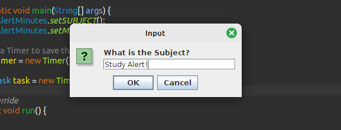

<h1 align="center">Setting an Alarm Clock</h1>

## 📖️ About
<p>This project aims to create alerts from time to time to wake up the user regarding a task or commitment.</p>

## 🤝️ Business rules
<p>This project is used to create alerts from time to time to wake up the user. The user enters the minutes they want to be alerted and the subject and waits for time to pass to receive the created alert. The user can restart the alert, or can finish it.</p>


<br/>
<p align="center">Practical examples below</p>
<hr/>

<h3 align="center">First part of Alert program interaction</h3>


<br/>

<h3 align="center">Second part of Alert program interaction</h3>


<br/>

<h3 align="center">Third part of Alert program interaction</h3>


<br/>

<h3 align="center">Fourth part of Alert program interaction</h3>


<br/>
<hr/>

## 🔨 Tools

- [OS - Linux Mint](https://www.linuxmint.com/download.php)
- [Java 22.ea.26-open across sdkman](https://sdkman.io/install)
- [Eclipse](https://eclipseide.org/)

<br />

```bash
	#Clone this project
    git clone https://github.com/giovanni0800/java-calculator.git
```

<br />
<hr />

## 📚 Libs
- java.util.Timer;
- java.util.TimerTask;
- javax.swing.JOptionPane.

## 📔️ License
This Project is under the MIT license. See the file LICENSE
for more details